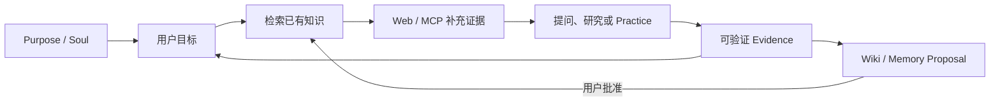

# Sage 前端产品收束与视觉系统设计

> 日期：2026-07-22
>
> 基线：`dev/sage-v7 @ f9cd7e6`
>
> 状态：视觉与产品方向已确认，生产实现未开始
>
> 范围：产品信息架构、主对话、Knowledge、设置与记忆、公开门面、视觉系统、组件边界和验收
>
> 不在范围：共享 Harness runtime、Knowledge 后端、API/DB 契约实现、生产部署

## 1. 设计结论

Sage 收束为一个以主对话为行动入口、以 Knowledge 为可观察知识结构的 Personal AI Learning Companion。

用户只需要理解两个核心入口：

1. **主对话**：描述目标、提问、研究、练习、批准沉淀，并查看真实运行事实。
2. **Knowledge**：导入 Obsidian、GitHub 或 Markdown 来源，观察 LLM Wiki 形成的结构，发现孤立节点与知识缺口，再把研究动作带回主对话。

确认采用的视觉与布局组合为：

| 决策面 | 已确认方向 | 结论 |
| --- | --- | --- |
| 整体视觉 | A `Soft Precision` | 中性浅底、克制阴影、少量 Sage 绿；不做全绿分栏或重拟物 |
| 主对话 | A1 `Dialogue + Facts` | 对话为主，右侧事实栏只承载 Goal、Run、Approval 与 Evidence |
| Knowledge | K2 `Immersive Graph Canvas` | 图谱占据主画布，工具与详情按需浮现，不常驻 Chat Dock |
| 设置 | S1 + S3 | 分组设置页 + `⌘K / Ctrl+K` 命令面板 |
| 成长记录 | 从主导航移除 | 私人进度回到主对话事实和证据；公开成果由独立公开门面承载 |

本设计不把聊天能力复制到 Knowledge，也不把图谱变成新的操作系统。Chat 负责行动，Knowledge 负责观察与治理，公开门面负责对外证明。

## 2. 与既有设计的关系

本设计延续以下既有原则：

- 主对话和所有 Surface 共用一套 Chat Harness、timeline、store 与 runtime；
- Coding 是按需调用的 Practice Engine，不是总入口；
- Knowledge 继续使用 Sigma、Graphology 与 ForceAtlas2 Worker；
- 所有运行动画和状态必须来自 timeline 事实；
- `graph_node / page / revision / graph_revision` 在用户从 Knowledge 发起动作时冻结为 `surface_context`；
- Wiki、Memory、Goal 与其他长期变更继续走 proposal/approval。

本设计正式覆盖 `2026-07-18-sage-goal-driven-chat-knowledge-frontend-design.md` 中两项已不再成立的体验决策：

1. **Knowledge 不再常驻共享 Chat Dock。** 节点研究通过明确动作回到主对话，并带入冻结上下文。
2. **Growth 不再是主导航 Surface。** 私人学习进度进入 Goal/Evidence 投影，外部成长展示进入独立公开门面。

旧设计中的 Harness 单例、timeline 事实源、图谱性能与审批边界仍有效。实现阶段若两份文档冲突，以本设计为准。

## 3. 产品命题与闭环

Sage 的核心不是“替用户保存更多内容”，而是让知识能够支持持续目标，并让每次行动产生可追溯增量：



### 3.1 三类持久对象

| 对象 | 作用 | 用户可见位置 |
| --- | --- | --- |
| `Purpose / Soul` | 描述用户长期方向、偏好和知识边界 | 设置中的个人上下文；主对话只展示必要摘要 |
| `Thread Goal` | 描述当前目标、完成条件与下一步 | 主对话顶部和事实栏 |
| `Evidence / Proposal` | 证明进展并请求持久化变化 | 主对话事实栏、审批抽屉；已存内容进入 Knowledge 或设置 |

### 3.2 页面分工

- **主对话**回答“我现在要做什么、Sage 正在做什么、需要我决定什么”。
- **Knowledge**回答“我的知识库目前是什么结构、缺口在哪里、这个节点来自什么”。
- **设置**回答“系统如何运行、使用哪些模型/工具、保存了哪些记忆”。
- **公开门面**回答“这个人做过什么、如何思考、有哪些可核验证据”。

## 4. 信息架构

### 4.1 主导航

桌面端主导航只保留：

1. 主对话
2. Knowledge
3. 公开门面（外链语义）
4. 设置（固定在底部）

不再把“今天”“成长记录”“Coding”“Publishing”并列为同级产品入口：

- 今天的概览并入主对话空态与会话侧栏；
- Growth 数据由 Goal、Mastery Evidence 和公开成果分别承载；
- Coding 从主对话的 Practice 动作进入；
- Publishing 从公开门面或命令面板进入，属于次级工作流。

### 4.2 路由迁移语义

现有路由不在第一实现切片中删除。实现阶段先改变导航和入口，再通过使用证据确认旧路由无引用后处理重定向：

| 当前路由 | 目标语义 |
| --- | --- |
| `/assistant` | 主对话空态与会话入口 |
| `/coding/session/:sessionId` | 主对话 Thread/Run 工作台；内部仍可沿用 Coding runtime |
| `/knowledge` | 沉浸式知识图谱与来源管理 |
| `/growth` | 从导航隐藏，后续重定向至主对话或公开门面 |
| `/publishing` | 次级发布工作台，从公开门面/命令面板进入 |
| `/public` | 应用内预览；独立 public build 保持外部入口 |
| `/settings/:section?` | S1 分组设置页 |

## 5. 视觉系统：A Soft Precision

视觉目标是“安静、精确、可信”，不是营销型仪表盘，也不是以绿色填满页面的传统管理后台。

### 5.1 视觉原则

- 中性浅灰承担页面背景，白色承担真正的操作表面；
- Sage 绿只标记品牌、确认与已验证状态，不作为所有边框和标题颜色；
- 蓝色用于检索、链接、恢复和当前焦点；琥珀色用于审批和知识缺口；红色用于失败；
- 卡片圆角上限 8px，不做卡片套卡片；页面章节优先使用留白、分隔线和排版建立层级；
- 阴影仅表达浮层、选中详情和输入焦点，不给每个列表项添加悬浮阴影；
- 页面内文字层级不超过四档，解释性文字默认折叠或按需出现。

完整 token 与组件规则见 `docs/product/style.md`。

## 6. 主对话：A1 Dialogue + Facts

### 6.1 桌面布局

```text
┌──────────────┬──────────────────────────────────┬────────────────────┐
│ Global Nav   │ Conversation                     │ Facts Rail         │
│ Threads      │ Goal header                      │ Current goal       │
│              │ Messages / tool summaries        │ Run state          │
│              │ Composer                         │ Approvals/Evidence │
└──────────────┴──────────────────────────────────┴────────────────────┘
```

- 全局导航宽度约 `220px`，支持收起为 `64px` 图标栏；
- 对话区为唯一主要滚动容器，建议最小宽度 `620px`；
- Facts Rail 默认宽度 `300px`，可收起，不允许出现第二条独立聊天流；
- Composer 固定在对话区底部，显示选中的模型、显式 Skill/MCP 入口和 context receipt；
- 完整 timeline 默认折叠为可扫描的 Run 摘要，用户展开后才查看工具明细。

### 6.2 空态

空态不做营销 Hero。首屏只呈现：

- 一句与当前 Purpose 相关的简短问候；
- 当前或最近 Goal；
- 三个任务型建议，例如“继续上次目标”“整理导入的知识”“开始一次练习”；
- 主输入框。

历史会话和知识状态进入左侧会话区，不在中心堆叠统计卡片。

### 6.3 事实栏顺序

Facts Rail 固定按影响用户决策的优先级排序：

1. 等待审批
2. 失败或可恢复运行
3. 当前 Goal 与完成条件
4. 本轮 Run 状态
5. Evidence 与待沉淀 Proposal
6. 已使用上下文和来源摘要

没有数据的模块不占位。完成状态在一轮结束后收为一行摘要，避免永久占据视线。

### 6.4 运行状态

| 状态 | 视觉 | 可用动作 |
| --- | --- | --- |
| 未开始 | 中性空心圆，无动画 | 发送、编辑 Goal |
| 运行 | 绿色细进度线，只在有事件推进时更新 | 停止、查看详情 |
| 工具 | 蓝色工具图标 + 工具名 + 事实摘要 | 展开输入/输出 |
| 审批 | 琥珀边框与明确风险文案 | 批准、拒绝、编辑 |
| 失败 | 红色状态线与失败原因 | 重试、恢复、返回最后稳定点 |
| 完成 | 绿色勾选，短暂强调后静止 | 查看 evidence、继续目标 |
| 恢复 | 蓝色恢复图标和 checkpoint 说明 | 继续、放弃恢复 |

严禁使用循环“思考中”文案、伪造 token 流或与 timeline 无关的节点动画。

## 7. Knowledge：K2 Immersive Graph Canvas

### 7.1 核心任务

Knowledge 不是另一个学习对话页。它只承担四件事：

1. 导入并查看来源；
2. 观察 LLM Wiki 生成的知识结构；
3. 定位社区、桥接节点、孤立节点与缺口；
4. 从选中节点发起 Deep Research，并回到主对话执行。

### 7.2 桌面布局

```text
┌──────────────┬───────────────────────────────────────────────────────┐
│ Global Nav   │ Workspace header / search / import                   │
│              ├───────────────────────────────────────────────────────┤
│ Sources      │                                                       │
│ compact list │             Immersive graph canvas                    │
│              │                              floating inspector       │
└──────────────┴───────────────────────────────────────────────────────┘
```

- 图谱画布获得除全局导航和紧凑来源栏外的全部空间；
- 社区图例、筛选和深度控制收在顶部工具栏或 popover，不堆叠多行标签；
- 默认不显示节点详情，不显示聊天；
- 悬停只显示最小 label 与邻域；点击后右下/右侧浮出节点详情；
- 详情卡包含标题、类型、社区、来源、更新时间、连接数和两个主要动作：“查看页面”“在主对话深入研究”。

### 7.3 图谱形态

图谱参考 Obsidian 的自然分布节奏和 `llm_wiki` 的知识组织思想，但保留 Sage 自己的语义：

- 社区通过克制、可区分的颜色表达，不使用彩虹散点；
- 节点大小由稳定、可解释的图指标决定，不能由 hover 导致布局变化；
- 细、低对比度边在全局态始终可见，使用户先感知结构；
- 桥接关系、孤立簇和卫星节点保留空间差异，不强行排成规则网格；
- 初次布局稳定后只做轻微收敛，不持续漂移；拖拽节点后局部重热并快速停止。

### 7.4 交互状态

| 状态 | 节点 | 边 | Label | 详情 |
| --- | --- | --- | --- | --- |
| 全局 | 社区色，低饱和 | 全部可见，低透明 | 只显示高权重节点 | 隐藏 |
| 悬停 | 当前节点放大约 8%，一跳邻居正常 | 一跳边增强，其余降至约 10% | 当前 + 关键邻居 | tooltip |
| 选中 | 双层选中环，`zIndex` 最高 | 一跳边高亮，二跳弱化，其余渐隐 | 当前 + 直接邻居 | Inspector 固定 |
| 路径 | 路径节点使用蓝色描边 | 路径边高亮 | 路径节点 | 路径摘要 |
| 缺口 | 琥珀虚线环或缺口标记 | 保持关系语义 | 缺口名称 | Deep Research 动作 |

选中环必须绘制在节点之上，并与节点填充解耦，避免深色节点被白色覆盖层遮住。

### 7.5 Deep Research 交接

用户点击“在主对话深入研究”时：

1. 前端读取当前 `graph_node / page / revision / graph_revision`；
2. 生成待提交的 context receipt；
3. 打开或复用主对话 Thread；
4. 在 Composer 上方展示可移除的上下文条；
5. 用户发送消息时由后端校验并冻结 receipt；
6. 主对话负责检索、Web/MCP、练习和 Proposal。

Knowledge 页面不显示模型回复，也不在后台自动启动研究。

### 7.6 导入流程

默认空态只提供三个来源：Obsidian vault、GitHub 仓库、Markdown 文件/目录。

```text
选择来源 -> 权限/路径确认 -> 扫描预览 -> 用户确认导入
         -> 摄取进度 -> LLM Wiki 生成 -> 图谱可探索
```

- 导入前说明读取范围和忽略规则；
- 进度只显示真实 job 状态，不用假百分比；
- 失败项可重试并保留成功结果；
- 原始来源、生成 Wiki 和图谱节点保持可追溯关系；
- 自动生成不等于自动批准长期变更。

## 8. 图谱性能预算

继续使用现有 Sigma + Graphology + ForceAtlas2 Worker，不无依据换库。

| 规模 | 默认策略 | 标签 | 边 | 布局 |
| --- | --- | --- | --- | --- |
| 0-200 节点 | 完整交互 | 高权重 + hover/selected | 全量，低透明 | Worker FA2，稳定后停止 |
| 201-1k 节点 | 视觉裁剪 | 只显示高权重、hover、selected、路径 | 按权重裁剪；选中邻域永不裁掉 | Barnes-Hut + 合并刷新 |
| 1k-5k 节点 | 社区入口 | 默认社区中心与代表节点 | 社区间边 + 当前邻域 | 后端预计算位置优先；局部增量布局 |
| 超过 5k 或 WebGL 异常 | 可搜索降级 | 列表/社区摘要 | 不渲染全量 | 明确说明限制，可进入局部图 |

验收预算：

- 200 节点首次可交互目标不超过 `1.2s`，交互保持 55fps 以上；
- 1k 节点首次可交互目标不超过 `2.5s`，拖拽/缩放保持 45fps 以上；
- 5k 节点不要求一次渲染全部边，必须在 `3s` 内提供可操作社区入口；
- hover/selected 更新不触发全图重新布局；
- 任何规模都不能出现空白画布、无限布局或选中后节点消失。

以上是产品预算，不代表当前实现已达到。实现计划需建立固定 fixture 和浏览器测量基线。

## 9. 设置与记忆：S1 + S3

### 9.1 S1 分组设置

设置按用户心智分为四组：

| 分组 | 子项 |
| --- | --- |
| 个人与体验 | 外观、Purpose/Soul、语言、通知 |
| 模型与能力 | Provider、模型、Skills、MCP |
| 数据与记忆 | Memory、上下文、Knowledge 来源、隐私与导出 |
| 运行与开发 | 会话、工作区、Usage、Run 与诊断 |

桌面使用左侧分组导航和右侧内容；移动端使用顶部选择器进入单一设置页面。危险操作统一置于分组底部并明确影响范围。

### 9.2 Memory 的位置

- 待批准 Memory Proposal 出现在主对话 Facts Rail，因为它要求即时决定；
- 已保存 Memory、来源和删除/导出操作位于设置；
- 文档、Wiki 页面和图谱节点位于 Knowledge；
- 不创建独立 Memory 主导航页。

### 9.3 S3 命令面板

`⌘K / Ctrl+K` 打开全局命令面板，提供：

- 跳转主对话、Knowledge、设置分组和公开门面；
- 新建对话、继续最近 Goal、导入知识来源；
- 查找会话、Wiki 页面、图谱节点；
- 打开 Provider、MCP、Memory 与 Usage 设置；
- 显式展示命令是否需要审批。

命令面板是导航和发现层，不直接绕过审批执行有副作用操作。

## 10. 公开门面

公开门面继续使用独立静态构建和公开资料集，不读取私人 Knowledge、Memory、Session 或 workspace。

页面目标不是复刻私人 Growth Dashboard，而是让 HR 或外部访客在三分钟内完成：

1. 理解 Sage 解决的问题；
2. 查看 2-4 个可验证工程案例；
3. 阅读简短技术笔记；
4. 使用受限 Ask Sage 查询公开内容并查看来源；
5. 跳转 GitHub、简历或联系方式。

公开问答在独立公开 Agent 契约到位前继续明确标记为限定资料问答，不伪装工具调用和实时研究。

## 11. 响应式设计

### 11.1 1728 桌面

- 导航 `220px`，主对话自适应，Facts Rail `320px`；
- Knowledge 来源栏 `240px`，其余全部给图谱；
- 允许同时显示主要任务与详情，但不再新增第四列。

### 11.2 1440 桌面

- 导航可收为 `64px`；
- Facts Rail 默认 `288px`，Knowledge Inspector 以覆盖浮层出现；
- 对话正文保持合理行宽，工具详情使用抽屉。

### 11.3 390 移动端

- 底部导航只保留主对话、Knowledge、设置；
- 主对话只显示单列消息，Facts 通过顶部状态按钮进入 bottom sheet；
- Knowledge 默认全屏图谱，来源、筛选、Inspector 分别使用 bottom sheet；
- 选中节点后保留至少 55% 的图谱可见区域；
- Composer、确认按钮和图谱控制满足至少 `44px` 触控目标。

## 12. 组件迁移与文件所有权

### 12.1 继续复用

| 现有能力 | 文件 | 方向 |
| --- | --- | --- |
| Chat Harness 布局 | `frontend/src/components/harness/ChatHarnessLayout.vue` | 继续作为单一布局壳，增加 A1 模式 |
| Chat 与 timeline | `frontend/src/components/harness/chat/**` | 保持单一消息与事实投影 |
| Harness session | `frontend/src/harness/useHarnessSession.ts` | 不复制 runtime/store |
| Surface context | `frontend/src/harness/surfaceContext.ts` | 支持 Knowledge -> Main Chat receipt 交接 |
| Graph renderer | `frontend/src/components/knowledge/KnowledgeGraphCanvas.vue` | 保留 Sigma 生命周期与性能分级 |
| Graph presentation | `frontend/src/components/knowledge/knowledgeGraphPresentation.ts` | 集中颜色、边、label 和性能策略 |
| Public build | `frontend/src/views/PublicProfileView.vue`、`frontend/src/router/public.ts` | 保持独立公开边界 |

### 12.2 建议拆分

实现阶段建议形成以下职责，不要求一次性重命名所有旧文件：

```text
frontend/src/components/product-shell/
  GlobalNavigation.vue
  CommandPalette.vue

frontend/src/components/conversation/
  ConversationWorkspace.vue
  GoalHeader.vue
  FactsRail.vue
  ContextReceiptChip.vue

frontend/src/components/knowledge/
  KnowledgeWorkspaceHeader.vue
  KnowledgeSourceRail.vue
  KnowledgeGraphToolbar.vue
  KnowledgeNodeInspector.vue
  KnowledgeImportFlow.vue

frontend/src/components/settings/
  SettingsGroupNav.vue
  MemorySettings.vue
```

- View 只负责路由级数据编排，不继续增长为巨型模板；
- Graph Canvas 只负责 renderer 生命周期、图数据和底层交互；
- Inspector、Toolbar、Import Flow 不进入 Canvas；
- Facts Rail 只消费 timeline/proposal/goal 的投影，不直接发明状态；
- 设置分组复用已有 store 方法，不把新的 API 逻辑散落到展示组件。

### 12.3 文件边界

- 本前端线可修改 `frontend/**` 和前端设计文档；
- 不修改 `core/harness/**`、`core/knowledge/**`、`api/**`、`db/**` 或 `packages/sage_harness/**`；
- 共享 API、timeline kind、capability 或 proposal 字段不足时，只提交 contract-gap 清单给 Harness 会话；
- 不以“临时可用”为理由复制第二套 chat store、WebSocket client 或 Knowledge runtime。

## 13. Contract Gap 清单

以下为实现前必须核对或由后端线确认的缺口，不在本设计阶段实现：

1. Knowledge -> Main Chat 的 frozen `surface_context` receipt 是否已持久绑定 `thread/run/message`、`graph_revision`、selection ref 与 page revision。
2. Purpose/Soul 的正式读写、revision、来源与可见范围契约。
3. 主对话 Facts Rail 所需 Goal evaluation、typed blocker、next action 和 Evidence 聚合是否有稳定投影。
4. Knowledge 导入 job 的真实阶段、失败项、可重试边界和 LLM Wiki 生成状态。
5. 图谱 1k-5k 的社区聚合、预计算位置和局部邻域接口。
6. 孤立节点与 knowledge gap 的判定字段，避免前端根据度数擅自等同“缺口”。
7. 已保存 Memory 的分页、来源、删除、导出和权限契约；Proposal 审批沿用现有 CAS/revision。
8. 命令面板跨会话、Wiki 和节点搜索的统一只读查询接口。
9. 公开 Agent 的独立 surface、公开 corpus、限流、usage 与 evidence citation 契约。

没有契约时，界面必须显示“尚未开放”或隐藏入口，不使用长期假数据模拟成功。

## 14. 可访问性与动效

- 所有关键功能可用键盘完成；图谱至少提供可搜索节点列表作为等价入口；
- 焦点环对比度清晰，不仅依赖颜色表达状态；
- 文本和图标满足 WCAG AA 对比度目标；
- hover 信息同时可通过 focus/click 获得；
- `prefers-reduced-motion` 下取消弹簧、漂移和连续布局，只保留不超过 `120ms` 的透明度变化；
- 动效仅来自用户操作或 timeline/job 事实；图谱初始收敛完成后静止。

## 15. 验收标准

### 15.1 产品与导航

- 新用户在首屏能分辨“主对话负责行动、Knowledge 负责观察”。
- 主导航不再同时出现 Today、Chat、Knowledge、Growth、Public 等同级入口。
- Coding 只能通过 Practice 语义进入，不显示为产品总入口。
- Growth 从主导航移除，旧地址有明确迁移行为且不丢数据。

### 15.2 主对话

- 1440 下对话正文宽度不少于 `620px`，Facts Rail 可收起。
- Approval、Failure、Recovery 永远排在普通统计之前。
- 运行状态可从 timeline 事件还原；刷新后不产生伪造状态。
- Knowledge context 在提交前显示“待提交”，后端确认后才显示“已冻结”。

### 15.3 Knowledge

- 默认画布不被永久 Chat Dock 或大段说明占用。
- 初始态存在可见细边；hover/selected 时邻域增强、无关边渐隐。
- 选中深色节点不会被白色覆盖层遮挡。
- Inspector 稳定联动，不因 hover 抢走 selected 状态。
- 200/1k/5k fixture 按性能预算降级，失败时提供可搜索列表而不是空白。
- Deep Research 明确跳转主对话并携带待冻结 context，不在 Knowledge 内生成第二条对话。

### 15.4 响应式与视觉

- `1728x1000`、`1440x900`、`390x844` 无页面级横向溢出、遮挡和嵌套卡片。
- 页面不依赖一套绿色明暗变化区分全部状态。
- 文字层级、按钮、图标、间距和阴影符合 `docs/product/style.md`。
- 命令面板可通过 `⌘K / Ctrl+K` 打开、搜索、关闭并恢复焦点。

### 15.5 工程证据

- 组件交互和投影纯函数有 Vitest 覆盖；
- 三尺寸使用真实浏览器截图并检查控制台错误；
- Sigma 画布执行非空像素、选中节点中心色和邻域边截图回归；
- 实现切片执行 `npm run test -- --run`、`npm run build` 和 `git diff --check`；
- 共享 contract 变化由后端线单独审查，前端 PR 不越界修改。

## 16. 非目标

- 本轮不实现生产 Vue 页面，不删除旧路由和旧组件；
- 不重写 Harness、Goal、Memory、Knowledge 或公开 Agent 后端；
- 不把模型自评、消息数量或 Wiki 数量包装为掌握度；
- 不在 Knowledge 内保留完整对话、运行画布或常驻 Chat Dock；
- 不因视觉问题更换 Sigma/Graphology/ForceAtlas2；
- 不复制 Obsidian、`llm_wiki`、Dribbble 示例或第三方品牌资产；
- 不把本地视觉原型描述为已交付功能。

## 17. 实施阶段边界

用户确认本书面规格后，再单独编写实施计划。计划应按可独立验证的纵向切片推进：

1. 视觉 token、全局导航与命令面板基础；
2. A1 主对话与 Facts Rail；
3. K2 图谱视觉、Inspector 和来源导入；
4. 设置分组与 Memory 收束；
5. 旧导航迁移、响应式、可访问性与性能回归。

每个切片在独立 `codex/*` 分支完成，通过 PR 合入 `dev/sage-v7`。具体任务、文件和测试只在书面规格通过审阅后确定。

## 18. 参考边界

- [llm_wiki](https://github.com/nashsu/llm_wiki)：参考知识摄取、Wiki 生成与知识组织出发点；不复制代码或视觉资产。
- [Obsidian Graph View](https://help.obsidian.md/plugins/graph)：参考全局图谱、邻域聚焦、缩放和筛选心智；不追求逐像素复刻。
- [Dribbble Neumorphism Dashboard](https://dribbble.com/shots/22865016-Dashboard-Neumorphism-UI-for-SaaS-Product)：只参考柔和表面和空间层次，Sage 不采用重阴影、过大圆角或营销式卡片墙。

交互原型位于本地忽略目录，仅用于设计决策，不进入生产构建或本次提交。
